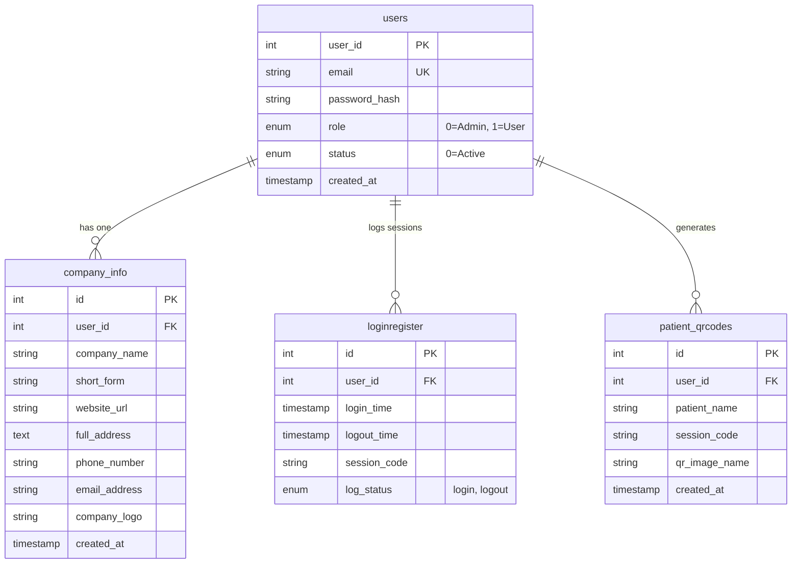

# MedQR+ — Smart Medical QR System

MedQR+ is a web-based medical patient QR identity system developed by **Biostarhealth**. The platform enables hospitals, clinics, and healthcare institutions to instantly generate branded digital QR codes and contact cards (`.vcf` vCards) for patients during outpatient (OP) visits. 

Instead of relying on physical paper cards or manual lookup, receptionists and medical staff can mint a QR identity code tied to the patient's OP number and hospital profile. Scanning the QR code instantly downloads/syncs the patient's vCard contact card onto clinician or staff devices, complete with hospital metadata, contact information, and record references.

---

## Table of Contents
- [Key Features](#key-features)
- [Tech Stack & Dependencies](#tech-stack--dependencies)
- [Folder Structure](#folder-structure)
- [Database Architecture](#database-architecture)
- [Local Setup & Installation Guide](#local-setup--installation-guide)
- [Default Login Credentials](#default-login-credentials)
- [Application Modules & Workflow](#application-modules--workflow)
- [Security & Architecture Notes](#security--architecture-notes)

---

## Key Features

### 🏢 Super Admin Console
- **Company / Hospital Management**: Add, edit, or remove registered healthcare organizations.
- **Branding & Logo Uploads**: Store and manage custom logos (`.jpg`/`.jpeg`) for each hospital.
- **Analytics Dashboard**: Overview of total registered companies, total patient QR codes created, and system health.

### 🏥 Hospital / User Console
- **Instant Patient QR Generation**: Mint patient identity QR codes with patient name and OP number in seconds.
- **Automatic vCard Generation**: Automatically creates standardized `.vcf` contact files embedding hospital name, phone number, address, website, and OP details.
- **Live Display Mode (Counter Display)**: Provides a dynamic `duplicate.php` live display page that automatically polls (`get_latest_qr.php`) and updates the displayed QR code every 3 seconds for secondary screens/monitors.
- **Device Linking**: QR-based device pairing (`link.php`) to open the live counter display on tablets or secondary mobile devices.
- **Patient History & Management**: Browse patient record history with search filters, date range filters (from/to), ASC/DESC sorting, and pagination (30 records per page).
- **Data Export**: One-click CSV export of filtered patient history data.
- **Credential Management**: Built-in password change module with secure password hashing.

---

## Tech Stack & Dependencies

| Component | Technology / Library | Description |
| :--- | :--- | :--- |
| **Backend Core** | PHP 8.x | Native PHP using MySQLi with Prepared Statements and Transactions |
| **Database** | MySQL / MariaDB | Relational Database Engine (`qr_base`) |
| **QR Code Engine** | `chillerlan/php-qrcode` (^5.0) | PHP Library for server-side PNG QR code rendering |
| **Frontend UI** | HTML5, CSS3, Vanilla JS | Custom responsive CSS & Fetch API AJAX integration |
| **UI Frameworks** | Bootstrap 5.3.2 | Grid system, responsive utility classes |
| **Icon Set** | FontAwesome 6.4.0 | Vector icon library |
| **Typography** | Google Fonts | Poppins & Inter fonts |
| **Alert Systems** | SweetAlert2 | Interactive modal popups and confirmation dialogs |
| **Server Engine** | Apache / Nginx | Web Server (XAMPP / cPanel compatible) |

---

## Folder Structure

```text
qrcode.biostarhealth.in/
│
├── README.md                 # Full project documentation
├── .htaccess                 # Server rewrites & cPanel PHP handler definitions
├── db_backup_dev.sql         # Full SQL dump for database initialization
├── index.php                 # Public Landing Page (Product showcase)
│
├── admin/                    # Super Admin Module
│   ├── index.php             # Admin dashboard home (stats & recent companies)
│   ├── header.php            # Shared admin topbar and navigation sidebar
│   ├── footer.php            # Shared admin layout footer
│   ├── register.php          # Form UI to register a new hospital/company
│   ├── insert_company.php    # AJAX API: Handles user creation & company registration
│   ├── user_control.php      # Table view to list, search, edit, and delete companies
│   ├── edit_company.php      # UI view for editing hospital details
│   ├── fetch_user_data.php   # AJAX API: Fetches company metadata for editing
│   ├── update_user_data.php  # AJAX API: Saves updated user & company information
│   ├── delete_company.php    # AJAX API: Deletes company & linked user account
│   ├── logout.php            # Destroys admin session and redirects to login
│   └── admin-style.css       # Custom styles for admin panel
│
├── css/                      # Landing Page Stylesheets
│   └── medqr-style.css       # Custom styling for public index page
│
├── include/                  # System Core Configuration
│   └── config.php            # Environment detection & MySQLi connection setup
│
├── js/                       # Public Frontend Scripts
│   └── medqr-script.js       # Interactivity scripts for landing page
│
├── login/                    # Authentication Module
│   ├── index.php             # Login view (Email & Password)
│   ├── login_process.php     # AJAX API: Authenticates user, sets session, logs audit
│   └── login-style.css       # Custom styling for login page
│
├── user/                     # Hospital / User Dashboard Module
│   ├── index.php             # Main dashboard & patient QR generator UI
│   ├── generate_qr.php       # AJAX API: Builds vCard, renders QR PNG, updates DB
│   ├── my_patients.php       # Patient history table, search, filters & CSV export
│   ├── duplicate.php         # Live counter display view (auto-refreshes via polling)
│   ├── get_latest_qr.php     # AJAX API: Polling endpoint for live view updates
│   ├── link.php              # UI view for linking secondary display devices
│   ├── change_password.php   # User password change UI
│   ├── process_change_password.php # AJAX API: Password verification and update
│   ├── logout.php            # Destroys user session and redirects to login
│   ├── user-style.css        # Custom styles for user panel
│   ├── composer.json         # Dependency configuration for chillerlan/php-qrcode
│   ├── composer.lock         # Locked composer dependency manifest
│   ├── contact.vcf           # Generated temporary vCard file for downloads
│   ├── qr/                   # Storage folder for generated patient QR PNG images
│   └── vendor/               # Installed Composer packages (QR generator library)
│
└── uploads/                  # Media Uploads Storage
    └── company_logos/        # Uploaded hospital/company logo files (.jpg)
```

---

## Database Architecture

The database name is `qr_base`. It consists of four primary relational tables:



### Table Details:
1. **`users`**: Stores user authentication credentials and roles (`role = 0` for Super Admin, `role = 1` for Hospital User).
2. **`company_info`**: Stores hospital/company metadata (company name, abbreviation, contact info, address, website, and logo file path). Cascades on user deletion (`ON DELETE CASCADE`).
3. **`patient_qrcodes`**: Stores generated patient QR records linked to the hospital `user_id` and active `session_code`.
4. **`loginregister`**: Audit log recording user login timestamps, logout timestamps, and session codes.

---

## Local Setup & Installation Guide

Follow these steps to run the application on your local machine using **XAMPP** (or any local WAMP/LAMP stack).

### Prerequisites
- **XAMPP** (with PHP 8.0 or higher & MySQL/MariaDB)
- **Composer** (PHP Package Manager)
- Web Browser (Chrome, Firefox, Edge)

---

### Step 1: Clone or Copy Project Files
Place the project directory inside your web server root directory (e.g., `C:\xampp\htdocs\qrcode.biostarhealth.in_backup_15_09_2026` or `C:\xampp\htdocs\medqr`).

---

### Step 2: Database Setup
1. Start **Apache** and **MySQL** services in the XAMPP Control Panel.
2. Open **phpMyAdmin** in your browser (`http://localhost/phpmyadmin`).
3. Create a new database named:
   ```sql
   CREATE DATABASE `qr_base` DEFAULT CHARACTER SET utf8mb4 COLLATE utf8mb4_general_ci;
   ```
4. Click on the `qr_base` database, go to the **Import** tab, choose the `db_backup_dev.sql` file from the project root, and click **Import**.

---

### Step 3: Configure Database Connection
Open `include/config.php` and verify the local environment setup:

```php
// Local environment configuration inside include/config.php
$is_local = in_array($server_name, ['localhost', '127.0.0.1']);

if ($is_local) {
    $db_host = 'localhost';
    $db_user = 'root';
    $db_pass = '';          // Set your local MySQL password if applicable
    $db_name = 'qr_base';
}
```

---

### Step 4: Install Dependencies (If needed)
The required vendor dependencies are pre-included under `user/vendor/`. However, if you need to reinstall or update dependencies:
1. Open terminal inside `user/` folder:
   ```bash
   cd user
   composer install
   ```

---

### Step 5: Verify Permissions
Ensure the following directories are writable by the PHP process:
- `user/qr/`
- `uploads/company_logos/`

---

### Step 6: Access the Application
Open your browser and navigate to:
- **Public Landing Page**: `http://localhost/qrcode.biostarhealth.in_backup_15_09_2026/`
- **Login Page**: `http://localhost/qrcode.biostarhealth.in_backup_15_09_2026/login/`

---

## Default Login Credentials

The database dump (`db_backup_dev.sql`) comes populated with standard development test accounts:

| User Type | Email | Password | Role | Redirect Path |
| :--- | :--- | :--- | :--- | :--- |
| **Super Admin** | `admin@gmail.com` | `admin123` | `0` (Admin) | `/admin/` |
| **Hospital / User** | `test@gmail.com` | `default123` | `1` (User) | `/user/` |

> ⚠️ **Note**: Passwords are securely hashed using PHP `password_hash()` (Bcrypt). When registering new companies via the admin panel, the initial default password assigned is `default123`.

---

## Application Modules & Workflow

### 1. Registration & Authentication Flow
- User submits credentials on `/login/index.php`.
- Request is processed asynchronously via `login_process.php`.
- System verifies email & password hash (`password_verify`).
- Upon success, a 16-digit random `session_code` is generated and saved in `$_SESSION['session_code']` and logged into `loginregister`.
- Based on role, user is redirected to `/admin` or `/user`.

### 2. Patient QR Generation Flow
- Hospital staff fills in **Patient Name** & **OP Number** inside `/user/index.php`.
- Form submits via AJAX to `/user/generate_qr.php`.
- System constructs a vCard string:
  ```text
  BEGIN:VCARD
  VERSION:3.0
  N:;SHORTFORM@OPNUM_PatientName;;;
  FN:SHORTFORM@OPNUM_PatientName
  ORG:Hospital Name
  TITLE:Patient Record
  TEL;TYPE=WORK:Phone Number
  EMAIL;TYPE=INTERNET:Email Address
  URL:Website URL
  ADR;TYPE=WORK:;;Address;;;;
  NOTE:OP Number - OPNUM
  END:VCARD
  ```
- `chillerlan\QRCode\QRCode` renders the vCard payload into a PNG image saved as `user/qr/qr_{session_code}_{timestamp}.png`.
- Record is saved to `patient_qrcodes` database table.
- JSON response returns the new image URL and downloadable `.vcf` file link.

### 3. Live Counter Display Polling Flow
- Hospital staff opens `/user/duplicate.php?user_id={session_code}` on a display monitor.
- Page runs a JavaScript polling loop every 3 seconds hitting `/user/get_latest_qr.php?session_code={session_code}`.
- When a receptionist generates a new QR code in their dashboard, the live display smooth-fades and updates the QR image instantly without reloading the page.

---

## Security & Architecture Notes

- **Prepared Statements**: All database operations use MySQLi prepared statements (`prepare()`, `bind_param()`, `execute()`) to prevent SQL injection vulnerabilities.
- **Password Hashing**: Passwords use `PASSWORD_DEFAULT` (Bcrypt) hashing via `password_hash()` and `password_verify()`.
- **Database Transactions**: Multi-query operations (e.g. creating user + inserting company info, or updating user + company metadata) use ACID transactions (`$con->begin_transaction()`, `$con->commit()`, `$con->rollback()`).
- **Input Sanitization**: User inputs are sanitized using `htmlspecialchars()` and validated via regex pattern matching.
- **File Upload Protection**: Logo uploads explicitly restrict file extensions to `.jpg`/`.jpeg` and validate MIME types (`image/jpeg`).
- **Session Security**: Session variables track `user_id`, `role`, and unique `session_code` for authorized execution across modules.

IF ANY DOUBTS FEEL FREE TO CONNECT
